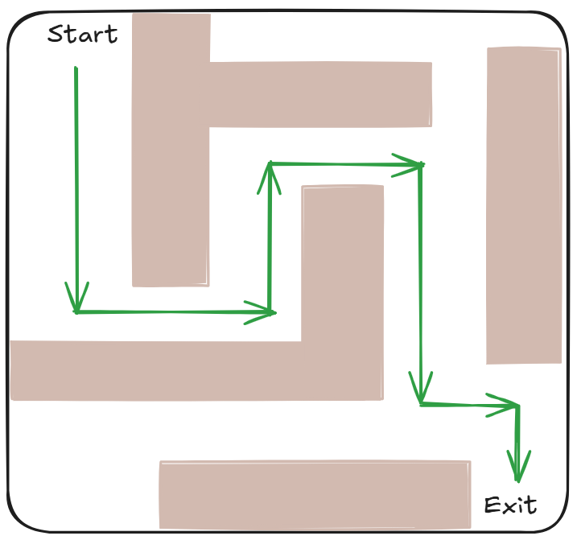

# Maze path finder algorithm
This repo presents a Python implementation of the algorithm to find the shortest path in a given maze. 

[1. Understanding the algorithm](#understanding-the-algorithm)

[2. How to run the project in Python 🐍](#how-to-run-the-project-in-python)

[3. Algorithm analysis](#algorithm-analysis)

## Understanding the algorithm
To understand the algorithm, I did some studying and compiled my research in the [study](docs/study.md) file.

After studying the algorithm a little, I implemented the algorithm in Python. I also **added comments to the code** to make it easier to understand each step of the algorithm.

---

## How to run the project in Python 🐍
The algorithm to find the Hamiltonian path in a graph, implemented in Python, can be found in [astar_pathfinder.py](code/astar_pathfinder.py) file. You can download it if you want to run it on your computer.

This guide assumes you already have Python installed on your computer, ok? ✅

### Step 1: open your terminal 🖥️
First, you need to open a command-line interface.

### Step 2: navigate to the correct folder 📂
You must tell the terminal where your `astar_pathfinder.py` file is located. You'll use the `cd` (change directory) command for this. Find the path to the folder containing the `astar_pathfinder.py` file you downloaded from this repo.

Type cd followed by a space and the path to your folder. Example:

`cd Folder1/Folder2/Folder3/MyProject`

### Step 3: run the file ▶️
Once you are in the correct folder, you can run the Python script. Type python followed by the name of your file. Example:

`python astar_pathfinder.py`

Enjoy!

---
